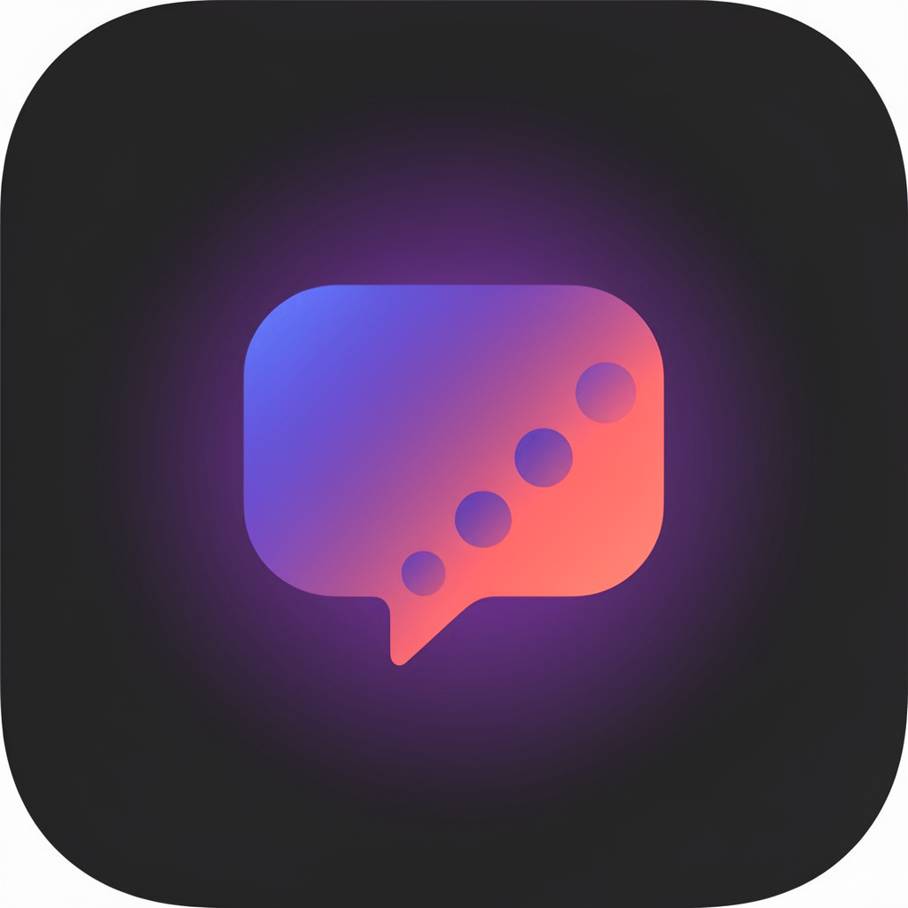

<div align="center">
  
  <h1>Lingora</h1>
  <p><strong>Speak the world into fluency.</strong> A modern, AI-powered, voice-first language-learning app — desktop (Electron) and web.</p>
  <p><em>Written & created by <strong>bananbenbadr</strong>.</em></p>
  <p>Lingora is a modern, AI-powered, voice-first language-learning app for desktop (Electron) and web: live voice conversation, courses, lessons, vocabulary, grammar, pronunciation, CEFR-based assessment, and an admin/authoring suite. This repository currently contains <strong>only the specification set</strong> — documents an engineering team (human or AI) can build the product from.</p>
  <p>The spec encodes a deliberate Electron + React + Supabase + Google Gemini architecture: a clean ~30-table Postgres schema with row-level security, three Supabase Edge Functions, a Gemini integration with a graceful fallback ladder, and a dual-mode live-voice subsystem. The docs are written so the product can be built correctly up front, with the design decisions spelled out rather than rediscovered.</p>
</div>

## What's in this repo

```
Lingora/
├── README.md                      ← you are here
├── AGENTS.md                     ← build order + conventions for AI/agent builders
├── .env.example                   ← all env vars the app expects
└── docs/
    ├── 00-OVERVIEW.md             ← vision, scope, key improvements vs the baseline, glossary
    ├── 01-PRD.md                  ← Product Requirements: personas, features, stories, acceptance criteria
    ├── 02-TAD.md                  ← Technical Architecture: system diagram, processes, data flow, tech choices
    ├── 03-TDD.md                  ← Technical Design: module design, state, contracts, algorithms
    ├── 04-BRAND-GUIDELINES.md     ← name, logo, palette, typography, voice & tone
    ├── 05-DESIGN-SYSTEM.md        ← tokens, components, theming, dark mode, accessibility
    ├── 06-UI-UX-SPEC.md           ← information architecture, page-by-page specs, user flows
    ├── 07-DATABASE-SCHEMA.md      ← clean Postgres schema (tables, RLS, indexes, functions)
    ├── 08-SUPABASE-EDGE-FUNCTIONS.md ← Edge Function specs (chat, live, transcribe)
    ├── 09-AI-INTEGRATION.md       ← Gemini models, level-based prompts, fallback ladder
    ├── 10-LIVE-CONVERSATION.md    ← dual-mode live voice subsystem (GenAI Live WS + Supabase relay)
    ├── 11-IPC-CONTRACT.md         ← type-safe Electron preload ↔ main channel contract
    ├── 12-DEVELOPMENT-SETUP.md    ← install, run, build, debug
    ├── 13-PROJECT-STRUCTURE.md    ← canonical file/folder layout
    ├── 14-TESTING-STRATEGY.md     ← unit / integration / E2E, coverage targets
    ├── 15-DEPLOYMENT.md           ← Electron distribution + Netlify web + Supabase
    ├── 16-SECURITY.md             ← IPC, RLS, key management, content safety
    ├── 17-ROADMAP.md              ← phased delivery plan (MVP → v1 → v2)
    └── 18-STITCH-PROMPTS.md       ← Google Stitch UI-generation prompts (preamble + per-screen sets)
```

## Tech stack (target)

- **Shell:** Electron 30 (main / preload / renderer), `contextIsolation: true`, `nodeIntegration: false`.
- **Renderer:** React 18 + TypeScript, Vite 5, React Router, Zustand state, Tailwind CSS, Radix UI primitives, Framer Motion, Lucide icons.
- **AI:** Google Gemini via the unified `@google/genai` SDK (text + live realtime + TTS).
- **Backend:** Supabase — Postgres (RLS), Auth, Storage, Realtime, Edge Functions (Deno).
- **Local/offline:** an Electron-backed local-store cache with sync queue.
- **Testing:** Vitest + Testing Library (unit/integration), Playwright (E2E).

## How to use these docs

Start with `AGENTS.md`, then `docs/00-OVERVIEW.md`. The PRD defines *what* and *why*; the TAD and TDD define *how*; the schema, edge-function, AI, live-voice, IPC, and deployment docs are the buildable contracts. Build in the order given in `AGENTS.md`.

## Author

**bananbenbadr** — writer and creator of Lingora.

## License

MIT.
